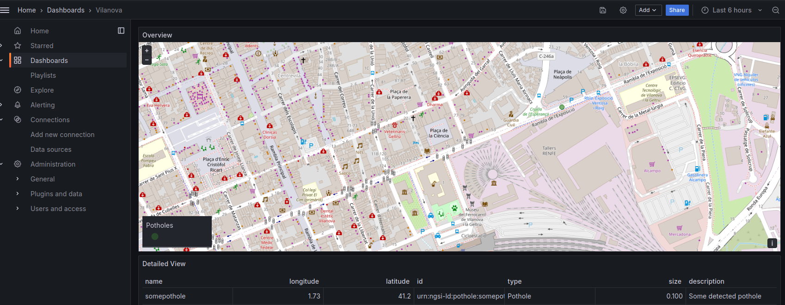
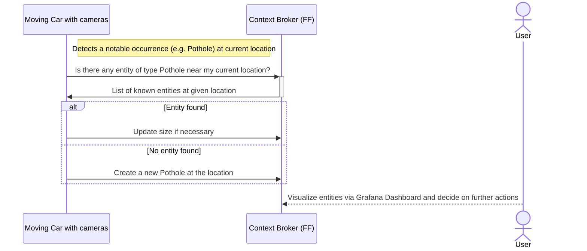

# city-maintenance-visualization
Demonstrator for a possible city maintenance visualization using a [NGSI-LD](https://www.etsi.org/deliver/etsi_gs/CIM/001_099/009/01.04.01_60/gs_cim009v010401p.pdf) based context broker as backend and Grafana as visualization tool.

Components used:
- [Orion-LD Context Broker](https://github.com/FIWARE/context.Orion-LD): Central Context Broker holding the current state of digital twins
- [Mintaka](https://github.com/FIWARE/mintaka): Implements the NGSI-LD temporal retrieval api to provide time series    
- [MongoDB](https://www.mongodb.com): NoSQL Database to store the digital twins
- [TimescaleDB](https://www.timescale.com/): PostgreSQL with time series support, used to persist the changes of the digital twins
- [Grafana](https://grafana.com/): Visualization tool coupled with the [NGSI-LD-Datasource Plugin](https://github.com/bfi-de/ngsild-grafana-datasource) to visualize the entities

## Lifecycle

To start execute

```
./run.sh
```
To stop execute

```
./stop.sh
```

## Usage
After starting, Grafana can be accessed via the website `http://localhost:3000`. The setup includes a preconfigured datasource and dashboard



To add entities in the context broker, following command can be used


```
curl  -iX POST 'http://localhost:1026/ngsi-ld/v1/entities' \
-H 'Link: <http://context/ngsi-context.jsonld>; rel="http://www.w3.org/ns/json-ld#context"; type="application/ld+json"' \
-H 'Content-Type: application/json' \
-d'{
    "id": "urn:ngsi-ld:pothole:someotherpothole",
    "type": "Pothole",
    "size": 2.0,
    "description": {
        "type": "Property",
        "value": "Some detected pothole"
    },
    "location": {
        "type": "GeoProperty",
        "value": {
            "type": "Point",
            "coordinates": [
                1.7334140332192022,
                41.22301170782136
            ]
        }
    }
}'
```

while following command can be used to find specific entities near a given coordinate:

```
curl -G -X GET \
'http://localhost:1026/ngsi-ld/v1/entities' \
-H 'Link: <http://context/ngsi-context.jsonld>; rel="http://www.w3.org/ns/json-ld#context"; type="application/ld+json"' \
-H 'Accept: application/json' \
-d 'type=Pothole' \
-d 'geometry=Point' \
-d 'coordinates=[1.7334140332199022,41.22301170782136]' \
-d 'georel=near;maxDistance==80000' \
-d 'options=keyValues'
```


A workflow could look like this:



## Acknowledgement

DIDYMOS-XR receives funding from the European Union's Horizon Europe research and innovation programme. 

 
